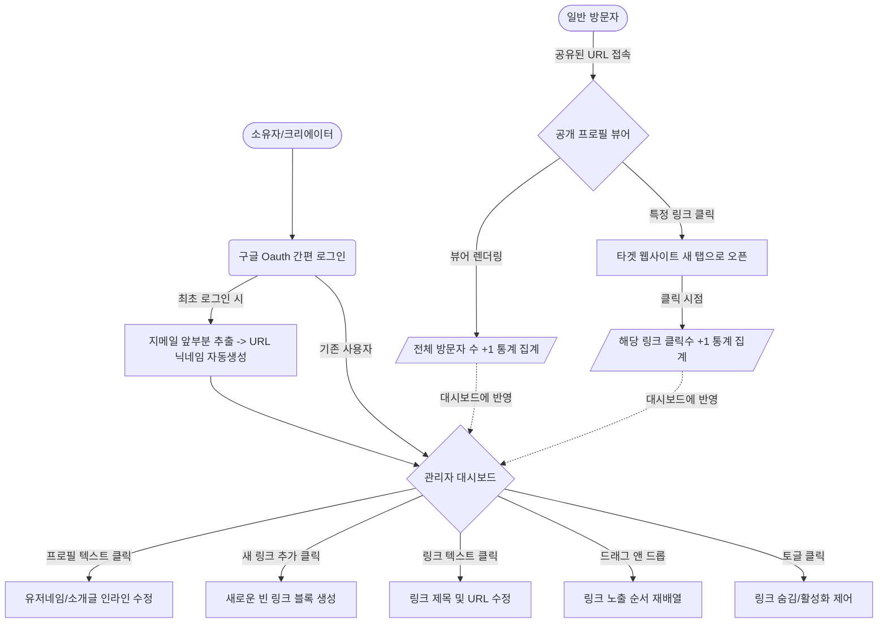

# 와이어프레임 (Wireframe) 및 화면 설계서 - 마이링크

마이링크 서비스의 화면 구조를 한눈에 파악하기 위해 **아스키 아트(ASCII Art)** 형태의 레이아웃과 **Mermaid 다이어그램** 기반의 화면 흐름도를 작성했습니다.

---

## 1. 아스키 아트 와이어프레임 (UI 레이아웃)

### 📱 A. 방문자용 공개 프로필 페이지 (`mylink.com/닉네임`)
방문자가 모바일 기기(또는 데스크톱)로 접속했을 때 보게 되는 깔끔한 단일 테마(Themeless) 기반의 뷰어 화면입니다.

```text
+------------------------------------------+
|                                          |
|               [ ( ㅡ_ㅡ ) ]              | <-- 구글 연동 프로필 이미지 (photoURL)
|                                          |
|           프론트엔드 개발자 나연         | <-- 유저네임 (username)
|      "안녕하세요! 제 포트폴리오입니다"   | <-- 한 줄 소개글 (bio)
|                                          |
|                                          |
|   +----------------------------------+   |
|   | [G]  나의 GitHub 레포지토리   >  |   | <-- 링크 1 (파비콘 + 인라인 타이틀)
|   +----------------------------------+   |
|                                          |
|   +----------------------------------+   |
|   | [B]  기술 블로그 (Velog)      >  |   | <-- 링크 2 (파비콘 + 인라인 타이틀)
|   +----------------------------------+   |
|                                          |
|           Powered by MyLink              |
+------------------------------------------+
```

<br>

### 💻 B. 소유자용 관리자 대시보드 (`/dashboard`)
마이링크 소유자가 로그인했을 때 링크를 인라인으로 관리 및 수정하는 대시보드입니다. 모든 텍스트 영역은 클릭 시 바로 수정되는 **인라인 편집**을 전제로 설계되었습니다.

```text
+------------------------------------------------------------------+
|  MyLink 로고       [ 총 방문자 수: 1,024 명 ]      [내 URL 복사] |
+------------------------------------------------------------------+
|                                                                  |
|  [프로필 설정 - 텍스트 클릭 시 즉시 인라인 수정]                 |
|                                                                  |
|   [ ( ㅡ_ㅡ ) ]  이름: [프론트엔드 개발자 나연 ]                 |
|                  소개: [안녕하세요! 제 포트폴리오입니다 ]        |
|                  주소: mylink.com/[ frontend_dev ]               |
|                                                                  |
|------------------------------------------------------------------|
|  [ + 새 링크 추가 ]                                              |
|                                                                  |
|  :: [G] [ 나의 GitHub 레포지토리 (클릭하여 수정) ] [보이기] [X]  |
|         [ https://github.com/nayeon8565          ]               |
|         ㄴ 누적 클릭수: 342                                      |
|                                                                  |
|  :: [B] [ 기술 블로그 (Velog) (클릭하여 수정)    ] [숨기기] [X]  |
|         [ https://velog.io/@nayeon85             ]               |
|         ㄴ 누적 클릭수: 120                                      |
|                                                                  |
+------------------------------------------------------------------+
- '::' 아이콘: 드래그 앤 드롭을 위한 핸들러 (순서 변경)
- '[보이기]/[숨기기]': 링크 비활성화 토글 스위치 
- '[X]': 링크 영구 삭제 버튼 (클릭 시 실행 취소 스낵바 노출)
```

---

## 2. 화면 흐름도 및 네비게이션 구조 (Mermaid Diagram)

전체 애플리케이션의 화면 전환 밑 데이터를 다루는 흐름을 나타낸 다이어그램입니다.



위 구조는 복잡한 모달(Modal) 창이나 설정 페이지를 완전히 걷어내고, 오직 **대시보드 단일 페이지 내에서 모든 것을 클릭만으로 편집**할 수 있게끔 설계한 것이 핵심입니다.
